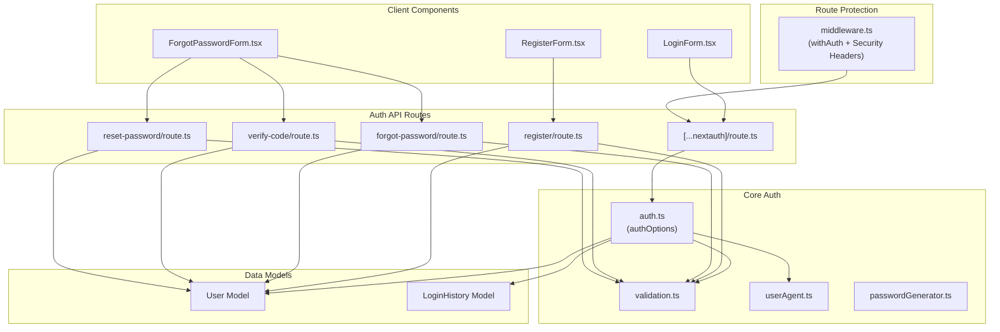

# Authentication Module Review — Phase 3 Complete

**Date:** July 17, 2026  
**Phase:** 3 — Authentication & Security (Days 26–35)  
**Status:** ✅ Complete — All 27/27 E2E tests passing

---

## Architecture Overview

---

## Files Reviewed

### Core Authentication
| File | Purpose | Status |
|------|---------|--------|
| `src/lib/auth.ts` | NextAuth credentials provider, OTP challenge, mobile time-gate, login history | ✅ Reviewed |
| `src/middleware.ts` | Route protection + HTTP security headers | ✅ Reviewed |
| `src/lib/mongodb.ts` | MongoDB connection singleton | ✅ Reviewed |
| `src/lib/passwordGenerator.ts` | Server-side random password generation | ✅ Reviewed |

### API Routes
| File | Purpose | Status |
|------|---------|--------|
| `src/app/api/auth/register/route.ts` | User registration with validation | ✅ Reviewed |
| `src/app/api/auth/forgot-password/route.ts` | OTP generation + rate limiting | ✅ Reviewed |
| `src/app/api/auth/verify-code/route.ts` | OTP verification | ✅ Reviewed |
| `src/app/api/auth/reset-password/route.ts` | Password reset with strict validation | ✅ Reviewed |

### Utilities
| File | Purpose | Status |
|------|---------|--------|
| `src/utils/validation.ts` | Centralised sanitization + validators | ✅ Reviewed |
| `src/utils/userAgent.ts` | Browser/device/OS parsing | ✅ Reviewed |

### Models
| File | Purpose | Status |
|------|---------|--------|
| `src/models/User.ts` | User schema with hidden security fields | ✅ Reviewed |
| `src/models/LoginHistory.ts` | Login audit log schema | ✅ Reviewed |

### Client Components
| File | Purpose | Status |
|------|---------|--------|
| `src/components/auth/LoginForm.tsx` | Login UI with OTP state handling | ✅ Reviewed |
| `src/components/auth/RegisterForm.tsx` | Registration UI with complexity validation | ✅ Reviewed |
| `src/components/auth/ForgotPasswordForm.tsx` | Multi-step recovery UI | ✅ Reviewed |

---

## Security Checklist

| Category | Measure | Status |
|----------|---------|--------|
| **Password Storage** | bcrypt hash with salt rounds 10 | ✅ |
| **Password Complexity** | Min 6 chars, requires letters + numbers (client + server) | ✅ |
| **Session Management** | JWT strategy via NextAuth | ✅ |
| **Input Sanitization** | HTML tag stripping on all inputs via `sanitizeString()` | ✅ |
| **Email Validation** | Regex on client + server via `validateEmail()` | ✅ |
| **Phone Validation** | E.164 format via `validatePhone()` | ✅ |
| **Field Protection** | `select: false` on password, tokens, OTP codes | ✅ |
| **OTP Challenge** | Chrome browsers require 6-digit email OTP | ✅ |
| **Mobile Time-Gate** | Logins blocked outside 10 AM – 1 PM | ✅ |
| **Rate Limiting** | Password reset limited to 1 per 24 hours | ✅ |
| **Security Headers** | X-Content-Type-Options, X-Frame-Options, X-XSS-Protection, Referrer-Policy, Permissions-Policy | ✅ |
| **Secret Management** | `.env.local` excluded from Git via `.gitignore` | ✅ |
| **Login Auditing** | All logins logged with IP, browser, OS, device type | ✅ |

---

## Test Coverage (27/27 Passing)

| # | Test Name | Status |
|---|-----------|--------|
| 1 | Database Connection | ✅ |
| 2 | Registration Validation (Empty) | ✅ |
| 3 | Registration Validation (Format) | ✅ |
| 4 | User Registration | ✅ |
| 5 | Password Encryption | ✅ |
| 6 | Duplicate Email Check | ✅ |
| 7 | NextAuth Authorize (Invalid Credentials) | ✅ |
| 8 | NextAuth Authorize (Success) | ✅ |
| 9 | Login History Tracking | ✅ |
| 10 | Chrome OTP Challenge — Trigger | ✅ |
| 11 | Chrome OTP Challenge — Invalid Code | ✅ |
| 12 | Edge Direct Login | ✅ |
| 13 | Mobile Restriction — Outside Window | ✅ |
| 14 | Mobile Restriction — Inside Window | ✅ |
| 15 | Strict Registration Validations | ✅ |
| 16 | Profile Database Update | ✅ |
| 17 | Profile Model Validation (Name) | ✅ |
| 18 | Forgot Password OTP (Email) | ✅ |
| 19 | Forgot Password OTP (Phone) | ✅ |
| 20 | OTP Verification — Invalid Code | ✅ |
| 21 | OTP Verification — Expired Code | ✅ |
| 22 | OTP Verification — Success | ✅ |
| 23 | Forgot Password Rate Limit — Immediate | ✅ |
| 24 | Forgot Password Rate Limit — After 24h | ✅ |
| 25 | Custom Password Generator | ✅ |
| 26 | Reset Password API Completion | ✅ |
| 27 | Database Teardown | ✅ |

---

## Issues Found & Resolved During Review

1. **Password generator mismatch** — `ForgotPasswordForm.tsx` generated letters-only passwords that failed strict validation. Fixed to produce alphanumeric passwords.
2. **Missing client-side complexity check** — `RegisterForm.tsx` checked length but not letter+number requirement. Added matching client-side validation.
3. **Missing client-side complexity check** — `ForgotPasswordForm.tsx` reset step had same gap. Fixed.

---

## Phase 3 Summary

Phase 3 (Days 26–35) is **complete**. The authentication module covers:
- Full registration and login flows with session management
- Multi-step password recovery (forgot → verify OTP → reset)
- Device-specific login policies (Chrome OTP, Edge bypass, mobile time-gate)
- Comprehensive input validation and sanitisation
- Hidden sensitive fields, HTTP security headers, and audit logging
- 27 automated E2E tests all passing

**Next Phase:** Phase 4 — Subscription & Payment System (Days 36–39)
